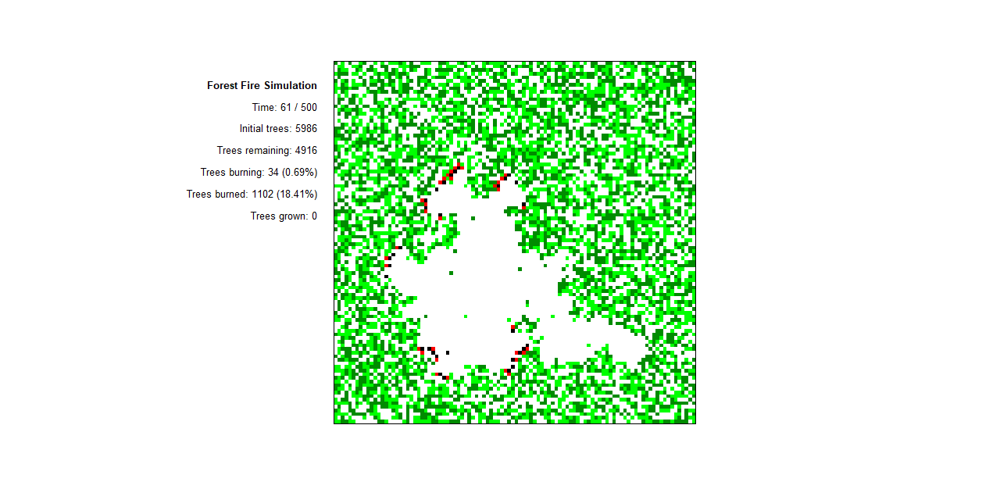

# Simulate and visualize forest fire dynamics

This script offers a simple model to simulate the dynamic of forest fires through a stochastic approach. Representing the forest as a grid, each cell within this grid can be empty, contain a tree, a burning tree, or the remains of a tree that has burned down. The model captures the interactions between different states—empty, tree, burning, and burned down—to visualize the progression of a forest fire over time. By incorporating mechanisms for tree growth, the spread of fire from burning trees to adjacent ones, and the cycle of destruction and regeneration characteristic of forest fires, the simulation provides an illustration of the ignition process, the spread of fire, and its aftermath over a specified number of steps. The inclusion of random elements mimics the unpredictability of tree growth and fire spread, making each simulation run unique. Users can adjust parameters such as the tree growth rate, fire spread probability, and initial tree density to explore various dynamics of forest fires under different conditions.

## License
This code is licensed under the MIT license found in the LICENSE file in the root directory of this source tree.

## Usage
To run this simulation, ensure R is installed on your computer. Execute the script within an R environment. The main function `simulate_forest_fire(tlength)` requires setting the total number of simulation steps.

The script initializes with default parameters for the simulation, but you can modify them as needed to explore different dynamics. 

### Parameters
- `grid_size`: The size of the grid representing the forest.
- `tree_growth_rate`: Probability of a new tree growing in an empty cell.
- `fire_spread_chance`: Probability of fire spreading from a burning tree to adjacent trees.
- `initial_trees_density`: Initial density of trees within the grid.
- `tlength`: Total number of simulation steps.
- `color_map`: Color map for visualizing the forest state.

## Installation
No special installation is required beyond R and the necessary libraries. Clone this repository or download the script file to run it within your R environment.
